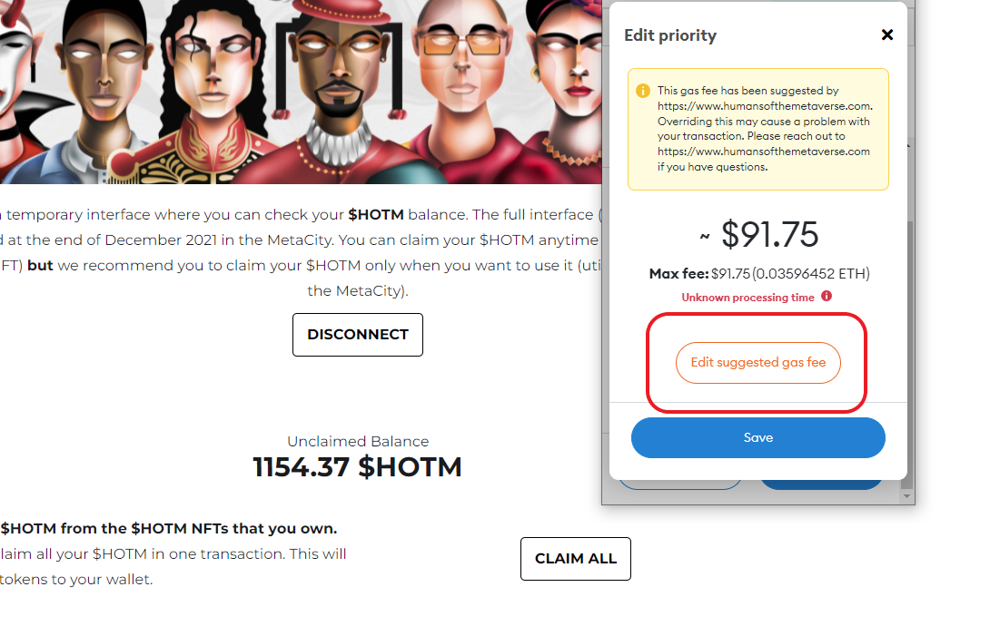

import Bleed from 'nextra-theme-docs/bleed'
import Callout from 'nextra-theme-docs/callout'

# Common Problems and Troubleshooting

This section is designed to take your through the basics of gameplay and how to do the things you need to do to succeed playing this game.

## Connecting to the Gameboard

<Bleed></Bleed>

<Bleed></Bleed>

<Bleed></Bleed>

## Brave Browser

If you are having issues connecting to the HOTM gameboard or using the site in Brave please make sure that you have disabled **Sheilds Up**

<Bleed></Bleed>

<Bleed></Bleed>

## Metacity Navigation

1. [Gameboard can be found here](https://metacity.humansofthemetaverse.com)

Let's take a look at a visual of the 49x49 gameboard that makes up the HOTM Metaverse

<Bleed></Bleed>

## Claiming Rewards

To claim rewards you need to head over to the HOTM check balance page

1. [HOTM Check Balance Page](https://www.humansofthemetaverse.com/hotm-check-balance)

<Bleed></Bleed>

<Bleed></Bleed>

### Claim Rewards with Low Gas

<Bleed></Bleed>

<Bleed></Bleed>

Make sure to lower **Max Priority Fee** and also **Max Fee**. 
I have safely claimed with as little as 70 gwei but it took approximately 8 hours for the transaction to be accepted. 
Once you have adjusted the numbers hit save and then you can confirm your transaction.

<Bleed></Bleed>

<Bleed></Bleed>

<Callout type="note" emoji="✅">
  [Claiming rewards with low gas fees - Video Tutorial](https://www.youtube.com/watch?v=lgtGERy9yHk)
</Callout>

## Placing Buildings

Alright you own land now you want to place a building. 

1. Head over to the [Gameboard](https://metacity.humansofthemetaverse.com)
1. Click on the plot of land that you want to add a building too. Your land plots will be light green.
1. Choose which building you want to place on your land.
1. Purchase the building with the required HOTM by sending the transaction to the network.
1. Once your transaction goes through the HOTM will be removed from your account and your building will appear.

<Bleed></Bleed>

<Bleed></Bleed>

## Sending Humans to Work

<Callout type="warning" emoji="⚠️">
   **Humans can only currently be added to Offices they cannot be added to Houses**
</Callout>

<Bleed></Bleed>

Now that you have a building placed on the Gameboard you need to add your humans to it so that they can get their extra 20% earnings.

1. Head to your building that you just placed on the board and this time when you click on it you will be presented with a different UI for adding humans to your office.
1. Pick the three humans you want to add to your office and submit your transactions.

<Callout type="warning" emoji="✅">
   [Link to the gameboard where you do all this stuff](https://metacity.humansofthemetaverse.com/)
</Callout>

<Bleed></Bleed>

<Callout type="error" emoji="🚫">
   Always be vigilant about checking links and resources please fam!
</Callout>
