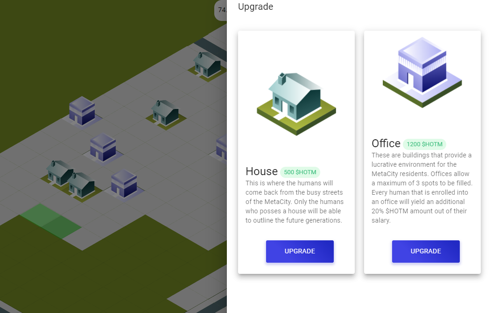

import Bleed from 'nextra-theme-docs/bleed'
import Callout from 'nextra-theme-docs/callout'

# Getting started in the HOTM Metaverse

This project brings a lot more then a simple pfp (ProFile Picture) NFT project. There is an entire ecosystem that anyone who plays this game needs to learn and pay attention to if they want to optimize their chances.

## Humans

The original part of the collection. Each human has a salary and their salary determins the nubmer of HOTM they earn each day during the first year of HOTM generation. 
HOTM is an erc-20 token that is earned by all generation 1 humans through a process of lazy staking. This means after buying a human there is nothing your lazy ass needs to do to start generating HOTM. 

## Land

<Callout type="warning" emoji="⚠️">
  **Owning land allows you to place an office building that ups your humans HOTM earnings by 20%** 
</Callout>

<Bleed></Bleed>

## Buildings

<Callout type="warning" emoji="⚠️">
  **There are two types of buildings currently available a house and an office**
</Callout>

<Bleed></Bleed>

## Scammers

<Callout type="error" emoji="🚫">
 Please keep in mind, no admin will DM you first, you should DM admin, and be cautious if someone DM you offering help, take screenshots as evidence and report the scammers. Let's work together to build a great community here!
</Callout>

Below is an example of the type of message you might get from a scammer. Please stay sharp!

<Bleed></Bleed>
