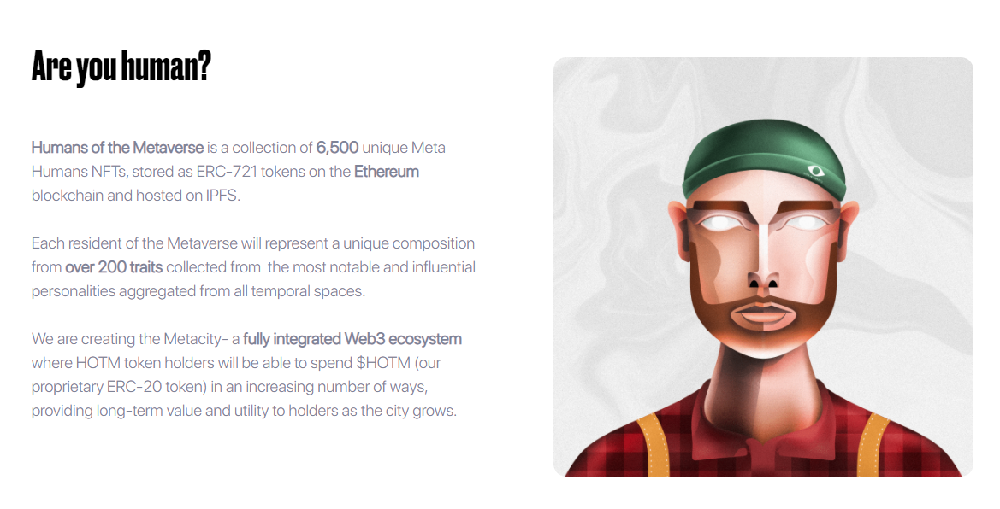
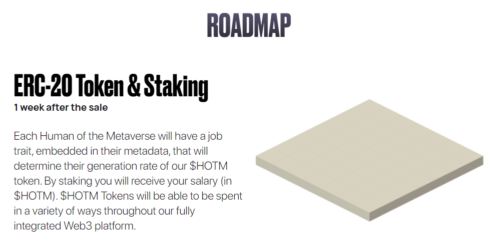
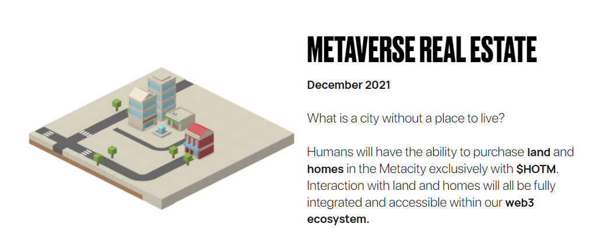
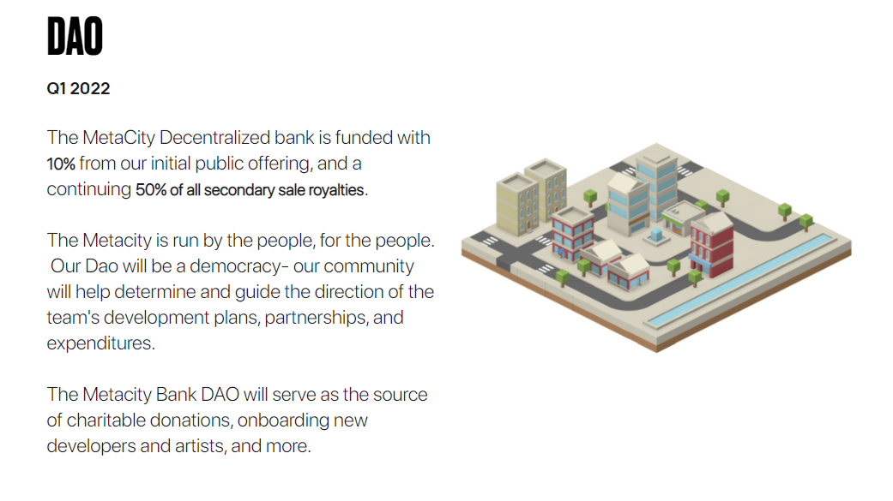
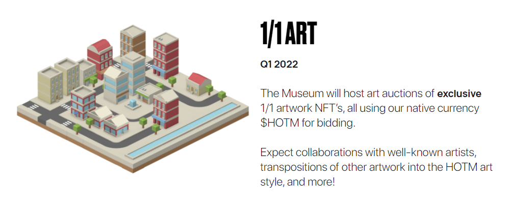

import Bleed from 'nextra-theme-docs/bleed'

# Humans of the Metaverse - Reference Guide

Humans of the Metaverse is a collection of 6,500 unique Meta Humans NFTs, stored as ERC-721 tokens on the Ethereum blockchain and hosted on IPFS.
‍
Each resident of the Metaverse will represent a unique composition from over 200 traits collected from  the most notable and influential personalities aggregated from all temporal spaces.

We are creating the Metacity- a fully integrated Web3 ecosystem where HOTM token holders will be able to spend $HOTM (our proprietary ERC-20 token) in an increasing number of ways, providing long-term value and utility to holders as the city grows.

<Bleed></Bleed>

<Bleed></Bleed>

<Bleed></Bleed>

<Bleed></Bleed>

<Bleed></Bleed>